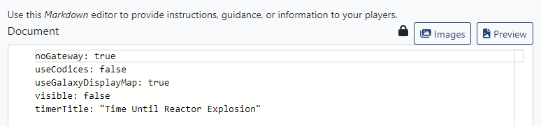
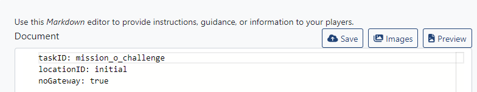
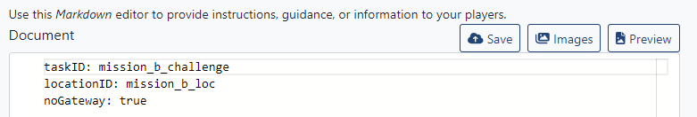

# Configuring the ship workspace

Cubespace requires there to be a "ship workspace" defined for any game. The ship workspace *can* be interlinked with challenges in order for players to use a single set of VMs with all challenges, this does come with a more difficult configuration even for basic connections. That includes specific workspace configuration that is outside the scope of this document.

The ship workspace must have *any* VM template added to it, in order for it to be detected as active. It's recommended to use a low-resource VM for this purpose.

In this document, we will discuss the configuration needed to deploy a standard Cubespace game with the official [PC5.json](./PC5.json), but with challenges swapped.

Here is an example workspace document for the ship workspace.

Note that there is no standard challenge guide in this workspace document. The configuration must be valid YAML, which means that anything that is not YAML must be commented with the standard YAML comment marker `#` or deleted entirely.

The `noGateway` field is used to signal that the workspace in question will not need to be networked with any other workspaces. We will set it to `true` for all of the example workspaces, as mentioned above.

`useCodices` is whether to use PC4-style icons in the bottom-right of the screen on mission completion. For non-PC4 games, it's recommended to set it to `false`, but it's just a display toggle.

`useGalaxyDisplayMap` configures whether the "Progress" button is able to be used in the game. For non-PC4 games, it's recommended to be `true`.

`visible` sets whether the VMs in the workspace will be listed on the players' workstations. Since we're only using the ship workspace for configuration in this document, `visible` is set to `false`.

`timerTitle` sets the text at the top of the screen in-game. It can be any arbitrary string, but generally its length should be no more than around 30 characters to avoid formatting issues.

# Setting up a challenge for Cubespace

The simplest kind of challenge to use in Cubespace is a standalone, self-contained challenge. These challenges do not rely upon any other workspaces in order to function and should be able to be completed outside of Cubespace. In order to create such a challenge, we will need to modify the workspace document.

Here is an example of the configuration for a single challenge.

`taskID` maps the workspace to a task in [PC5.json](./PC5.json). All missions have a task of the format `mission_x_challenge`, where `x` is the same as the letter at the end of the mission ID. For reference, missions are alternatingly "unlocked" and "locked" missions, meaning that `a`, `c`, `e`, etc. are unlocked at the start, and `b`, `d`, `f` are unlocked by the unlocked mission that preceeds them in the list. In the official JSON, missions go up through `mission_p`. `taskID` values should not be used in more than one challenge within a game.

`locationID` maps the workspace to a location. The official PC5 JSON has nine locations - `initial`, which is the location at which the players start the game and where all of the initially-unlocked missions take place, and eight locations of the format `mission_x_loc`, where again `mission_x` is the same mission ID as one of the locked missions.

Like the ship workspace, this example is given with `noGateway` set to `true`.

Here is another example of a workspace document, but this time for one of the challenges that start locked.

# Relevant model

The `GamespaceData` class in [model.py](./gamebrain/gamedata/model.py) has the most up-to-date version of the data that is expected to be found in a Workspace Document, with more details of each field's usage.

# Gameboard

A game will need to be configured in Gameboard. The PC5 game should be copied and modified for this purpose. In the copy, remove the existing challenges in the `Edit` view. Then, in the `Search` view, find the new challenges that need to be added. Once added, switch back to the `Edit` view and configure points and any bonuses that should be associated with the challenges.
